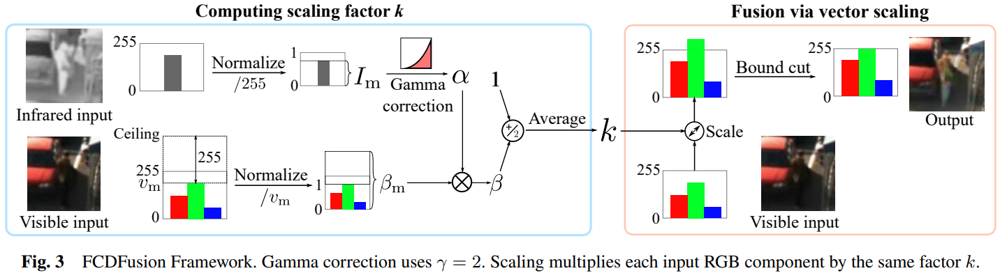
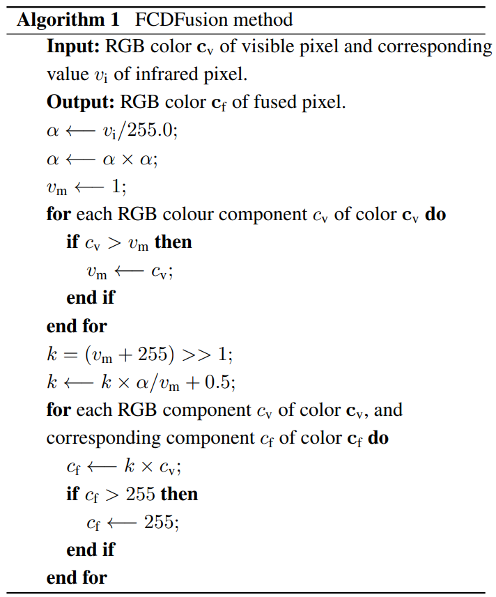
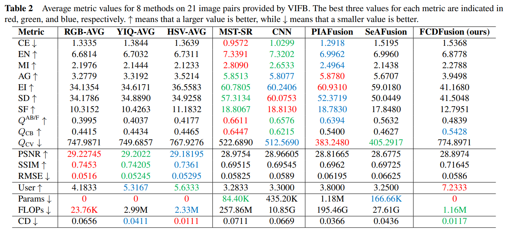
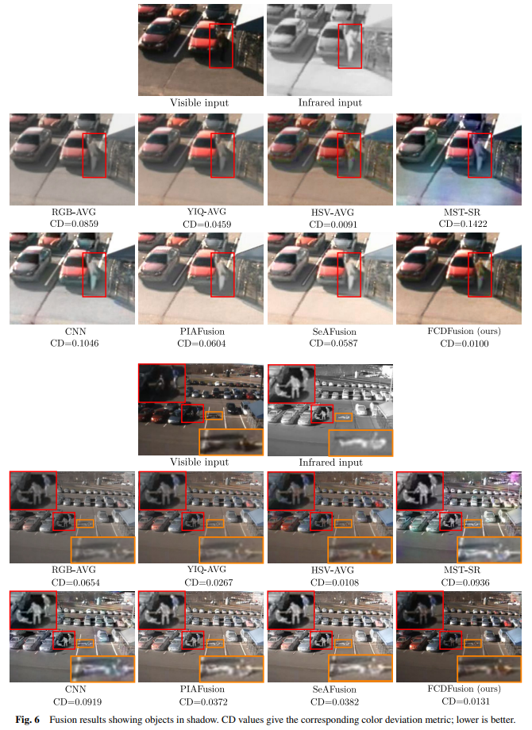
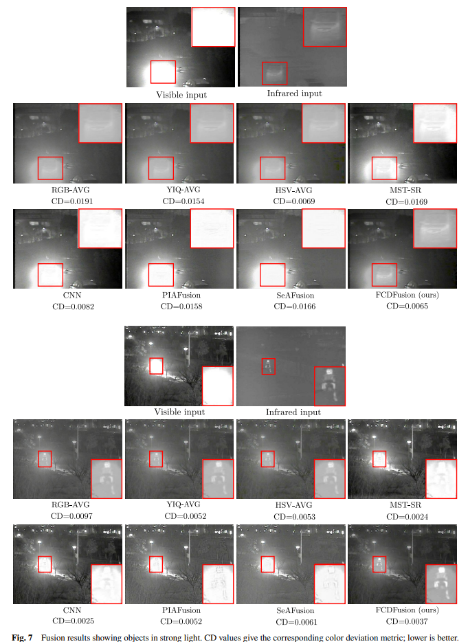

# FCDFusion
We propose a fast and color-preserving fusion method for visible and infrared image pairs, and a metric called color deviation.

This is the Python implementation of the paper "FCDFusion: a fast, low color deviation method for fusing visible and infrared image pairs".

The paper is accepted by Computational Visual Media.

# Method

# Results

# Environment
numpy

opencv-python
- These codes run in Python environment on the CPU to show the algorithms. If you need speed up, please rewrite them in C language or use CUDA and other GPU accelerators.

# How to use
Download or clone the repository:

`git clone https://github.com/HeasonLee/FCDFusion`

Go into the directory "/FCDFusion":

`cd FCDFusion`

## Fuse image pairs using RGB, YIQ, HSV and FCDFusion methods
1. Put visible images and corresponding infrared images into "/input/visible" and "/input/infrared", respectively. The two paired input images should be in the same shape and has the same name like "xxx.jpg". You can change codes in "fuse.py" to change the available image type.
2. You can change line 78~81 in "fuse.py" to select methods to run. Default: RGB, YIQ, HSV and FCDFusion methods.
2. Run the fusion methods: `python fuse.py`
3. Fusion results will be saved in "/output/\<method name\>".

- 6 pairs of test images selected from VIFB are already in "/input/visible" and "/input/infrared". You can find more test image pairs in VIFB or other datasets.
- FCDFusion is the proposed method. RGB, YIQ and HSV are 3 fast and simple methods for comparison. CNN and MST-SR are 2 methods from VIFB for comparison. PIAFusion  and SeAFusion are 2 new methods from Information Fusion 2022 for comparison. You can find more methods in VIFB or other papers.

## Compute color deviation metrics of fused images
1. Put visible images and corresponding fused images into "/input/visible" and "/output/\<method name\>", respectively. The two paired images should be in the same shape and has the same name like "xxx.jpg". You can change codes in "color_deviation.py" to change the available image type.
2. You can change line 27 in "color_deviation.py" to select methods to be evaluated. Default: RGB, YIQ, HSV, CNN, MST-SR, PIAFusion, SeAFusion and FCDFusion methods.
4. Run the script: `python color_deviation.py`
5. Color deviation of each fused image and the average color deviation value of each method will be shown in the screen and saved in "/output/color_deviation_values.txt".

- Color deviation is the proposed metric that measures color-preserving ability of a fusion method. You can find more metrics in VIFB.
